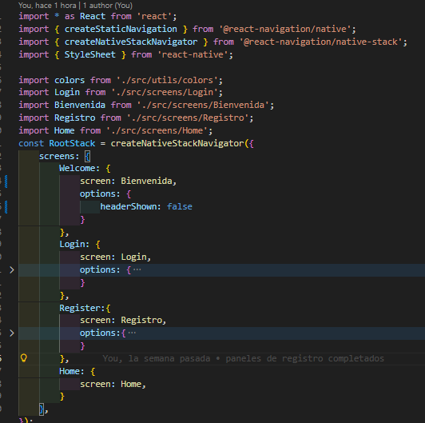

# FIXORA - APLICACION MOBILE


Es una plataforma móvil integral diseñada para conectar de manera rápida y segura a usuarios domésticos con técnicos especialistas en reparaciones y mantenimiento (gasfitería, electricidad, albañilería, etc.).

## Objetivo del proyecto

Digitalizar el mercado de servicios técnicos locales en Perú, eliminando la informalidad y la dificultad de encontrar profesionales de confianza. Agrega valor mediante un sistema de valoraciones, geolocalización en tiempo real y perfiles técnicos validados.

## Contexto

Pertenece al sector de Servicios On-Demand (Economy Gig) y mantenimiento del hogar, un mercado en crecimiento que busca la conveniencia de la "uberización" aplicada a las reparaciones domésticas.

## Justificación del Proyecto

- **Motivación**

  El proyecto nace al observar la falta de un canal centralizado y confiable en ciudades como Lima para contratar técnicos. Actualmente, el proceso depende de recomendaciones de boca en boca o anuncios informales en calles, lo que genera inseguridad sobre la calidad del trabajo y el precio justo.

- **Público objetivo**
  - **Clientes:** Personas adultas (25-60 años) que buscan soluciones rápidas para averías en el hogar.
  - **Técnicos:** Profesionales independientes o especialistas que desean aumentar su cartera de clientes y formalizar su presencia digital.

## Requisitos funcionales

1. **Registro Multirole:** Flujo diferenciado por pasos para Clientes y Técnicos (incluyendo validación de documentos).
2. **Geolocalización:** Uso de GPS para mostrar técnicos cercanos al domicilio del cliente.
3. **Gestión de Consultas:** Creación, seguimiento de estado (Pendiente, En Camino, Completado) y cancelación de servicios.
4. **Sistema de Valoraciones:** Feedback mutuo entre cliente y técnico para garantizar la calidad.

## Requisitos no funcionales

1. **Rendimiento:** Uso de programación reactiva para manejar múltiples solicitudes simultáneas.
2. **Seguridad:** Encriptación de contraseñas y validación de sesiones.
3. **Escalabilidad:** Arquitectura de base de datos preparada para soportar el crecimiento de usuarios sin pérdida de velocidad.

## Tecnologías Utilizadas

- **Lenguajes de programación:** Java (Backend) y JavaScript (Frontend).
- **Framework y herramientas:** Spring Boot (con Spring WebFlux para reactividad) y React Native con Expo para la app móvil.
- **Bases de datos:** MySQL (Relacional) para una gestión consistente de usuarios y transacciones.
- **APIs y servicios externos:** Google Places API (autocomplete de direcciones), Google Maps SDK (visualización) y Mercado Pago (planeado para la pasarela de pagos).
- **Plataforma(s):** Android y iOS.

## Instalacion

### Clonacion del repositorio

```bash
git clone https://github.com/Cristian04-gif/Home-fixer-hub-appMobile.git
```

### Acceder al directorio

```bash
cd Home-fixer-hub-appMobile
```

### Instalar dependencias

```bash
npm install
```
## Dependencias

```bash
"dependencies": {
    "@react-navigation/native": "^7.2.2",
    "@react-navigation/native-stack": "^7.14.10",
    "expo": "~54.0.33",
    "expo-checkbox": "~5.0.8",
    "expo-status-bar": "~3.0.9",
    "react": "19.1.0",
    "react-native": "0.81.5",
    "react-native-element-dropdown": "^2.12.4",
    "react-native-safe-area-context": "~5.6.0",
    "react-native-screens": "~4.16.0"
  }
```

### Navegacion

#### Instalar dependencias:
```bash
npm install @react-navigation/native @react-navigation/native-stack
npx expo install react-native-screens react-native-safe-area-context
```
#### Codigo:

**Directorio:**

    Fixora-appMobile\App.js



## Ejecucion

```bash
npm start
```
<video src="./assets/md/ejecucion.mp4" controls width="100%"></video>

